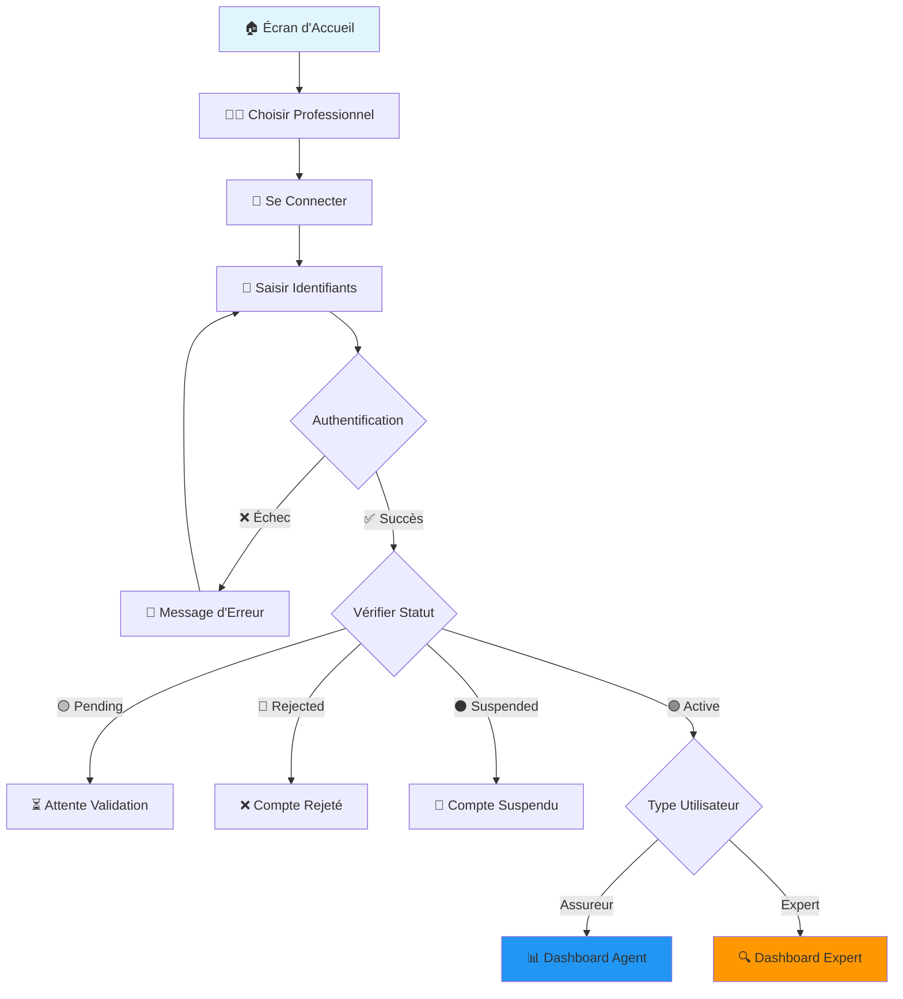

# 🏢 Guide de Connexion pour les Professionnels

## 📋 Vue d'ensemble

Les agents d'assurance et experts peuvent maintenant se connecter facilement à l'application Constat Tunisie avec un système de connexion dédié et sécurisé.

## 🔐 Système de Connexion Professionnel

### **Écrans de Connexion Disponibles**

#### 1. **Agents d'Assurance** 
- **Écran** : `ProfessionalLoginScreen(userType: 'assureur')`
- **Couleur** : Bleu
- **Icône** : Business
- **Redirection** : Dashboard Agent d'Assurance

#### 2. **Experts**
- **Écran** : `ProfessionalLoginScreen(userType: 'expert')`
- **Couleur** : Orange
- **Icône** : Assignment
- **Redirection** : Dashboard Expert

## 🚀 Comment Se Connecter

### **Étape 1 : Accéder à l'Écran de Connexion**
1. Ouvrir l'application Constat Tunisie
2. Choisir "Agent d'Assurance" ou "Expert"
3. Cliquer sur "Se connecter"

### **Étape 2 : Saisir les Identifiants**
1. **Email professionnel** : L'email utilisé lors de l'inscription
2. **Mot de passe** : Le mot de passe choisi lors de l'inscription

### **Étape 3 : Validation du Compte**
Le système vérifie automatiquement :
- ✅ **Type d'utilisateur** correct
- ✅ **Statut du compte** (actif, en attente, rejeté, suspendu)
- ✅ **Authentification** Firebase

## 📊 Statuts de Compte

### **🟢 Actif (active)**
- Connexion autorisée
- Accès complet aux fonctionnalités
- Redirection vers le dashboard

### **🟡 En Attente (pending)**
- Connexion refusée
- Message : "Votre compte est en attente de validation par un administrateur"
- Action : Attendre l'approbation admin

### **🔴 Rejeté (rejected)**
- Connexion refusée
- Message : "Votre compte a été rejeté. Raison: [raison]"
- Action : Corriger les problèmes et repostuler

### **⚫ Suspendu (suspended)**
- Connexion refusée
- Message : "Votre compte a été suspendu. Contactez l'administrateur"
- Action : Contacter l'admin

## 🎯 Dashboards Disponibles

### **Dashboard Agent d'Assurance**
- **Écran** : `HierarchicalAgentDashboard`
- **Fonctionnalités** :
  - Gestion des contrats
  - Traitement des sinistres
  - Suivi des clients
  - Rapports d'activité

### **Dashboard Expert**
- **Écran** : `ExpertDashboardScreen`
- **Fonctionnalités** :
  - Gestion des expertises
  - Rédaction de rapports
  - Évaluation des dommages
  - Calendrier des rendez-vous

## 🔧 Fonctionnalités de Sécurité

### **Validation Multi-Niveaux**
1. **Authentification Firebase** - Vérification email/mot de passe
2. **Vérification du type** - Assureur vs Expert
3. **Contrôle du statut** - Compte actif requis
4. **Permissions** - Accès basé sur le rôle

### **Gestion des Erreurs**
- **Email invalide** : "Email invalide"
- **Mot de passe incorrect** : "Mot de passe incorrect"
- **Compte non trouvé** : "Aucun compte trouvé avec cet email"
- **Trop de tentatives** : "Trop de tentatives. Réessayez plus tard"

## 📱 Interface Utilisateur

### **Design Adaptatif**
- **Couleurs spécifiques** par type d'utilisateur
- **Icônes distinctives** pour chaque rôle
- **Messages contextuels** selon le statut
- **Feedback visuel** en temps réel

### **Expérience Utilisateur**
- **Validation en temps réel** des champs
- **Messages d'erreur clairs** et actionables
- **Indicateurs de chargement** pendant la connexion
- **Navigation intuitive** vers les dashboards

## 🔄 Flux de Connexion Complet



## 🧪 Tests de Connexion

### **Test 1 : Connexion Agent d'Assurance**
```
1. Choisir "Agent d'Assurance"
2. Cliquer "Se connecter"
3. Saisir email/mot de passe d'un compte assureur validé
4. Vérifier redirection vers dashboard agent
```

### **Test 2 : Connexion Expert**
```
1. Choisir "Expert"
2. Cliquer "Se connecter"
3. Saisir email/mot de passe d'un compte expert validé
4. Vérifier redirection vers dashboard expert
```

### **Test 3 : Compte en Attente**
```
1. Utiliser un compte avec statut "pending"
2. Vérifier message d'attente de validation
3. Confirmer que la connexion est refusée
```

## 🚨 Dépannage

### **Problème : "Compte non trouvé"**
```
Solutions :
1. Vérifier l'orthographe de l'email
2. S'assurer que le compte a été créé
3. Vérifier dans la collection 'users' de Firestore
```

### **Problème : "Mot de passe incorrect"**
```
Solutions :
1. Vérifier la saisie du mot de passe
2. Utiliser la fonction "Mot de passe oublié"
3. Contacter l'administrateur si nécessaire
```

### **Problème : "Mauvais type d'utilisateur"**
```
Solutions :
1. Vérifier le type de compte (assureur vs expert)
2. Utiliser le bon écran de connexion
3. Contacter l'admin pour correction si nécessaire
```

## 📞 Support

### **Pour les Utilisateurs**
- Utiliser la fonction "Mot de passe oublié"
- Contacter l'administrateur via l'application
- Vérifier les emails de notification

### **Pour les Administrateurs**
- Vérifier les statuts de compte dans le dashboard admin
- Consulter les logs Firebase pour les erreurs
- Utiliser les outils de gestion des permissions

---

**🎉 Le système de connexion professionnel est maintenant opérationnel !**

**Fonctionnalités disponibles :**
- ✅ Connexion sécurisée pour assureurs et experts
- ✅ Validation automatique des statuts de compte
- ✅ Dashboards dédiés par type d'utilisateur
- ✅ Gestion complète des erreurs
- ✅ Interface utilisateur adaptative

**Date de mise à jour :** $(date)
**Version :** 2.0
**Statut :** ✅ Prêt pour utilisation
