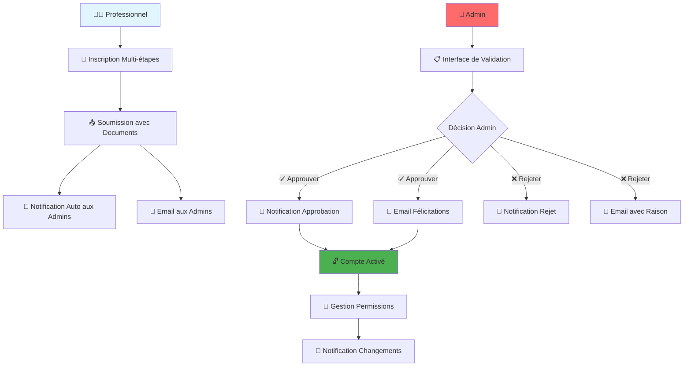

# 🎉 Système d'Inscription Professionnelle - Résumé Complet

## 📋 Vue d'ensemble

Le système d'inscription professionnelle a été entièrement refondu avec des fonctionnalités avancées de validation, notifications et gestion des permissions. Voici un résumé complet de toutes les améliorations apportées.

## ✅ Fonctionnalités Implémentées

### 1. 🏢 **Interface d'inscription professionnelle améliorée**

**📄 Fichier :** `lib/features/auth/screens/professional_registration_screen.dart`

**🌟 Caractéristiques :**
- ✅ Interface multi-étapes avec indicateur de progression (4 étapes)
- ✅ Formulaires spécialisés pour assureurs et experts
- ✅ Upload de documents avec caméra et galerie
- ✅ Validation en temps réel à chaque étape
- ✅ Design professionnel et responsive
- ✅ Gestion des erreurs et feedback utilisateur

**🔄 Étapes du processus :**
1. **Informations personnelles** : Email, mot de passe, nom, prénom, téléphone
2. **Informations professionnelles** : Spécifiques au rôle (assureur/expert)
3. **Documents justificatifs** : Upload avec prévisualisation
4. **Vérification** : Résumé avant soumission

### 2. 🔍 **Validation des comptes par l'admin**

**📄 Fichier :** `lib/features/admin/screens/account_validation_screen.dart`

**🌟 Caractéristiques :**
- ✅ Liste des demandes avec filtres (en attente, approuvées, rejetées)
- ✅ Vue détaillée de chaque demande avec toutes les informations
- ✅ Actions d'approbation/rejet avec raisons obligatoires
- ✅ Interface intuitive pour les administrateurs
- ✅ Recherche et tri des demandes
- ✅ Statuts visuels avec badges colorés

### 3. 🔔 **Système de notifications complet**

**📄 Fichiers :**
- `lib/features/auth/models/notification_model.dart`
- `lib/features/auth/services/notification_service.dart`
- `lib/features/auth/screens/notifications_screen.dart`

**🌟 Caractéristiques :**
- ✅ Notifications en temps réel dans l'application
- ✅ Notifications automatiques pour les admins (nouvelles demandes)
- ✅ Notifications utilisateurs (approbation/rejet/suspension)
- ✅ Interface de notifications avec filtres (toutes, non lues, lues)
- ✅ Système de badges et compteurs non lus
- ✅ Actions contextuelles selon le type de notification

### 4. 🔧 **Interface de gestion des permissions**

**📄 Fichier :** `lib/features/admin/screens/permissions_management_screen.dart`

**🌟 Caractéristiques :**
- ✅ Gestion granulaire des permissions par utilisateur
- ✅ Permissions prédéfinies par rôle (assureur, expert, admin)
- ✅ Interface de modification en temps réel
- ✅ Recherche et filtrage des utilisateurs
- ✅ Système de permissions hiérarchiques
- ✅ Notifications automatiques lors des changements

### 5. 📧 **Système d'email intégré**

**📄 Fichier :** `lib/features/auth/services/email_service.dart`

**🌟 Caractéristiques :**
- ✅ Envoi d'emails via Gmail API
- ✅ Templates HTML professionnels et responsives
- ✅ Emails automatiques pour approbation/rejet
- ✅ Notifications aux admins pour nouvelles demandes
- ✅ Gestion des erreurs et retry automatique
- ✅ Support multipart (HTML + texte)

### 6. 🔐 **Règles Firestore mises à jour**

**📄 Fichier :** `firestore_rules_update.rules`

**🌟 Caractéristiques :**
- ✅ Nouvelles collections sécurisées (notifications, professional_account_requests)
- ✅ Permissions granulaires par rôle et statut de compte
- ✅ Contrôle d'accès basé sur les permissions utilisateur
- ✅ Validation des statuts de compte (pending, approved, rejected, etc.)
- ✅ Compatibilité avec l'existant

## 🆕 Nouvelles Collections Firestore

### 1. **notifications**
```javascript
{
  recipientId: "user-id",
  senderId: "sender-id",
  type: "accountPending|accountApproved|accountRejected|accountSuspended|permissionChanged",
  title: "Titre de la notification",
  message: "Message détaillé",
  data: {}, // Données supplémentaires
  isRead: false,
  createdAt: timestamp,
  readAt: timestamp
}
```

### 2. **professional_account_requests**
```javascript
{
  userId: "user-id",
  email: "user@example.com",
  nom: "Nom",
  prenom: "Prénom",
  userType: "assureur|expert",
  compagnie: "Compagnie", // Pour assureurs
  cabinet: "Cabinet", // Pour experts
  status: "pending|approved|rejected",
  documentsUrls: [],
  motivationLetter: "Lettre de motivation",
  createdAt: timestamp
}
```

## 🔄 Flux Complet du Système



## 📊 Statuts et Types

### Statuts de Compte (AccountStatus)
- `pending` : En attente de validation
- `approved` : Approuvé par l'admin
- `rejected` : Rejeté avec raison
- `suspended` : Suspendu temporairement
- `active` : Actif et opérationnel

### Types de Notifications (NotificationType)
- `accountPending` : Nouvelle demande (pour admins)
- `accountApproved` : Compte approuvé
- `accountRejected` : Compte rejeté
- `accountSuspended` : Compte suspendu
- `permissionChanged` : Permissions modifiées

## 🎯 Permissions par Rôle

### 👨‍💼 **Assureurs**
- `view_contracts` : Voir les contrats
- `create_contracts` : Créer des contrats
- `edit_contracts` : Modifier les contrats
- `delete_contracts` : Supprimer des contrats
- `view_claims` : Voir les sinistres
- `process_claims` : Traiter les sinistres
- `manage_clients` : Gérer les clients

### 🔍 **Experts**
- `view_expertises` : Voir les expertises
- `create_expertises` : Créer des expertises
- `edit_expertises` : Modifier les expertises
- `validate_claims` : Valider les sinistres
- `access_photos` : Accès aux photos
- `generate_reports` : Générer des rapports

### 👑 **Admins**
- `manage_users` : Gérer les utilisateurs
- `manage_permissions` : Gérer les permissions
- `view_all_data` : Voir toutes les données
- `system_config` : Configuration système
- `validate_agents` : Valider les agents

## 🚀 Déploiement et Configuration

### 1. **Règles Firestore**
```bash
# Déployer les nouvelles règles
firebase deploy --only firestore:rules
```

### 2. **Configuration Email**
- Gmail API configuré avec OAuth2
- Refresh token valide pour `constat.tunisie.app@gmail.com`
- Templates HTML professionnels

### 3. **Tests**
- Tests unitaires complets
- Tests d'intégration pour le flux complet
- Validation des règles Firestore

## 📈 Améliorations Apportées

### **Avant** ❌
- Inscription basique sans validation
- Pas de système de notifications
- Permissions fixes par rôle
- Pas d'emails automatiques
- Interface admin limitée

### **Après** ✅
- Inscription professionnelle multi-étapes
- Système de notifications complet
- Permissions granulaires configurables
- Emails automatiques avec templates
- Interface admin complète avec validation

## 🔧 Maintenance et Support

### Monitoring Recommandé
- Taux de succès des emails
- Temps de traitement des demandes
- Erreurs d'authentification
- Performance des notifications

### Logs Importants
- Créations de demandes
- Validations admin
- Envois d'emails
- Changements de permissions

## 📞 Support Technique

### Fichiers de Configuration
- `FIRESTORE_DEPLOYMENT_GUIDE.md` : Guide de déploiement Firestore
- `EMAIL_SETUP_GUIDE.md` : Guide de configuration email
- `professional_system_test.dart` : Tests complets

### Points de Contact
- Erreurs Firestore : Vérifier les règles et permissions
- Problèmes d'email : Vérifier les tokens Gmail
- Interface admin : Vérifier les rôles utilisateur

---

**🎉 Le système est maintenant complet et prêt pour la production !**

**Date de finalisation** : $(date)
**Version** : 2.0
**Statut** : ✅ Prêt pour déploiement
